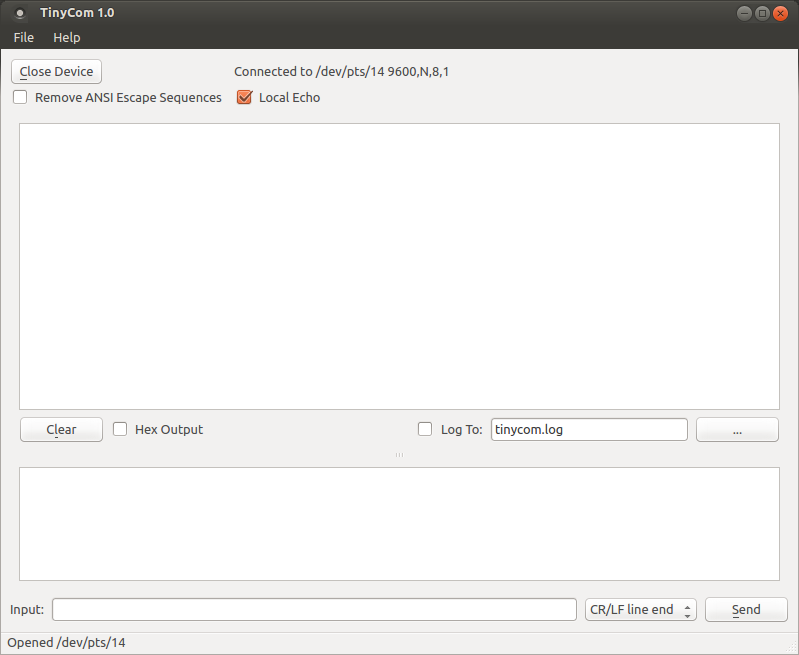

TinyCom
=======

A simple line based serial terminal GUI written in Python. This is a tool that's
useful for talking to a variety of serial based hardware that can involve custom
protocols or just a standard command line interface.  It runs on anything that
supports Python and Qt.

TinyCom is inspired by the original [CuteCom](http://cutecom.sourceforge.net/).

Features
--------

* Line oriented input and output, with configurable line ending.
* Customizeable serial port configuration.
* Automatically enumerates platform serial ports.
* History of input lines, to easily regenerate them with a click.
* Log the session to a file.

Runtime Requirements
--------------------

This is just an overview of runtime requirements. All major versions of both the
Python interpreter and QT API are supported.

* [Python2 or Python3](https://www.python.org/)
* [PyQt4 or PyQt5](https://riverbankcomputing.com/software/pyqt/intro) or
  [PySide](https://wiki.qt.io/PySide)
* [Qt](https://www.qt.io/)
* [pySerial](https://github.com/pyserial/pyserial)

Installation
------------
For simplicity, instructions for only PyQt4 and Python2 are listed here.
However, you can adjust to use any combination of Python2/Python3 and
PyQt4/PyQt5/Pyside if you prefer when it comes to runtime dependencies.

On Ubuntu, first install dependencies using the system package manager.

    sudo apt-get install python python-qt4 python-serial python-pip

Then, use pip to install tinycom.

    pip install [--user] tinycom

Or, if you're installing from source:

    pip install [--user] tinycom-<version>.tar.bz2

The --user option causes tinycom to be installed in your home directory under
~/.local.

Then, if you somehow get fed up with TinyCom's awesomeness, uninstall it.

    pip uninstall tinycom

Running
-------

Just execute `tinycom`.

Screenshots
-----------

PyQt4/PyQt5/PySide
------------------
TinyCom can use PyQt4, PyQt5, or PySide for its Qt API.  As long as you have one
installed, it will be automatically detected and used at runtime. However, if
you wish to force a specific Qt API, you can set the QT_API environment variable
to one of the following values when running.

    QT_API=pyqt4 tinycom
    QT_API=pyqt5 tinycom
    QT_API=pyside tinycom

License
-------
TinyCom is licensed under GPL Version 3.  See the `LICENSE.txt` file.  `qt.py`
is licensed under 3-clause BSD.  `pyside_dyanmic.py` is MIT licensed.
